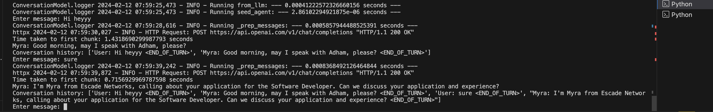
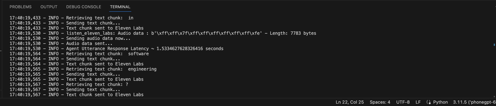

# Outbound Phone GPT

Outbound Phone GPT is a sophisticated prototype for a context-aware agent designed to autonomously handle outbound phone calls through Twilio. Leveraging the power of asynchronous programming, this agent seamlessly integrates text generation from OpenAI, transcription from Deepgram, and voice generation from Eleven Labs, providing a seamless and efficient communication experience.

## License

This project is licensed under the GPL License - see the [LICENSE](LICENSE) file for details.


## Features

- Context-Aware Conversations: Engages in meaningful dialogues, tailored to the specifics of each phone call.
- Conversation Management: Manages the flow of conversations, ensuring coherent and goal-oriented interactions.
- Twilio Integration: Utilizes Twilio's robust API for handling outbound phone calls.
- STT and TTS: Incorporates Deepgram for Speech-to-Text (STT) and Eleven Labs for Text-to-Speech (TTS) capabilities.
- Response latency: ~1-2s depending on speed of inference of Open AI's streamed response


**Note:** 

If you are located in the US, it is possible to achieve response latency of around ~1.5s. This is due the benefits 
of better geographic proximity with Open AI's servers, which allows for faster inference (Time from initial request to first chunk of content recieved from Open AI ~ 250ms). 

For example in my region, latency can vary significantly. The example below shows Open AI's inference taking ~1.4s to deliver the 
first chunk of the generated text stream:




Despite this, the complete speech to speech framework of Outbound Phone GPT has achieved commendable latencies. The example below
showcases response latency of ~1.5s




## Technologies and External APIs

- FastAPI: For creating REST APIs with Python.
- WebSockets: For real-time bidirectional communication.
- Twilio's API: For phone call management.
- Deepgram: For real-time speech recognition.
- Eleven Labs: For dynamic and natural-sounding voice synthesis.
- Baby AGI framework inspired by Filip Michalsky's SalesGPT -> https://github.com/filip-michalsky/SalesGPT

## Setup and Installation

### 1) Create a Python Virtual Environment:

``` python
python -m venv venv
source venv/bin/activate  # On Windows use `venv\Scripts\activate`
```


### 2) Install Dependencies:

``` python
pip install -r requirements.txt
```


### 3) Set up your Ngrok server on a new terminal:
Make sure you have Ngrok downloaded: https://ngrok.com/docs/getting-started/. Then set up the server through the terminal:
``` bash
ngrok http <HHTP_SERVER_PORT>
```

### 4) Set up Environment Variables:
Use the provided `.env.example` as a reference to create your `.env` file with your keys.


### 5) Agent Configuration:

- **Step 1: Agent configuration file**
    In your agent configuration json file you are required to provide the `prompt` (The agent's system prompt) and `agent_name` (name assigned to the agent). When writing the prompt you must include `{conversation_history}` as part of the prompt, as this will enable the agent's context awareness and ability to control conversation flow using the agent's stage analyzer assistant.

    You can also add additional fields to the JSON file (see example at: /example_agent_configs). All additional fields 
    will be set as agent attributes and will be available for access at any point throughout the call.

    The best practice for writing prompts is to use place holders instead of hard written values. For example, let's say my JSON config file
    has a value for `agent_name`, `agent_role`, `prospect_name` and `call_purpose` and I want to use these values within my prompt. Instead of hard wroting the values within the prompt, you can utilise these values in the prompt. 

    For example:
    ``` json
    "agent_name"="Myra",
    "agent_role"="BDR",
    "call_purpose"="See if the prospect is interested in XYZ",
    "prompt"="Your name is {agent_name} and your role is {agent_role}. You are calling {prospect_name} for {call_purpose}. You will find the conversation history below:\n\n{conversation_history}"
    ```

- **Step 2: Go to /ConversationModel/prompts.py**
    Write a custom `STAGE_ANALYZER_INCEPTION_PROMPT` as per the examples given, to suit your use case

- **Step 3: Go to /ConversationModel/stages.py**
    Write a custom set of `CONVERSATION_STAGES` as per the examples given, to suit your use case

- **Step 4: Go to /ConversationModel/playground.py**
    Test your agent's configuration through a chat-like interface in the program's terminal. This is important as it allows you
    to refine your agent's configuration before setting up your agent to take phone calls.

### 6) App Configuration:
Edit the `__config__.py` file to set up OpenAI, Eleven Labs, Deepgram keys, and the ngrok server settings. Use
the example `__config__.py` file for guidance.


### 7) Choose your implementation:
Go to `app.py` and choose your implementation by uncommenting the method of choice, and commenting out the others. Here's a breakdown of the methods you can choose from:
Method 1: Doesn't utilise the agent's cache or the agent's filler prediction capabalities. This is the default method.
Method 2: Utilises the agent's cache but not the agent's filler prediction capabalities
Method 3: Incoporates both the agent's cache and filler prediction capabilities
**Keep in mind that the filler prediction model is experimental for the time being.**


### 8) Start the Project:
Run `app.py` to initiate the server


## Endpoints:

`/make-call`

Initiates an outbound call. Can accept a JSON with a custom 'welcome_message'. If you send an empty JSON, make sure 
that a `default-starter.wav` file exists within your audio files directory.
``` json
{}  // For default welcome message
{"welcome_message": "Hello, this is Myra from Escade Networks."}
```

`/generate-filler`

Processes a list of sentence fillers and generates corresponding audio files. Can accept a JSON of the following format:
``` json
{
    "fillers": [
        ["Filler text 1", "file_name_1"],
        ["Filler text 2", "file_name_2"],
        ["Filler text 3", "file_name_3"]
    ]
}
```

`/update-cache`

Adds predefined questions and answers to the agent's cache. Can accept a JSON of the following format:
``` json
[
    {"key": "Hi", "value": "Hey, how is it going?"},
    {"key": "Who are you?", "value": "I'm Myra, the recruitment director at Escade Networks."},
    {"key": "Why are you calling?", "value": "I'm calling to discuss your application for one of our job openings..."}
]
```